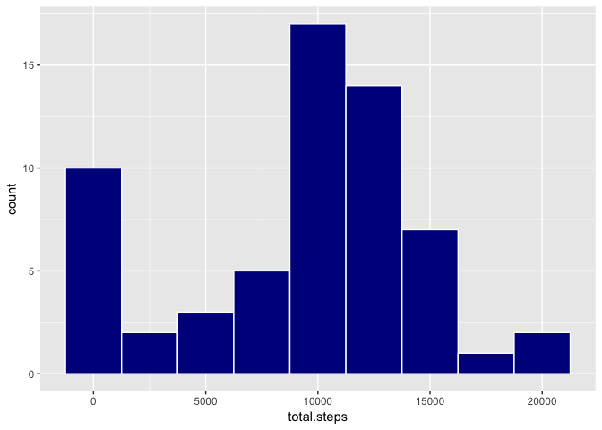
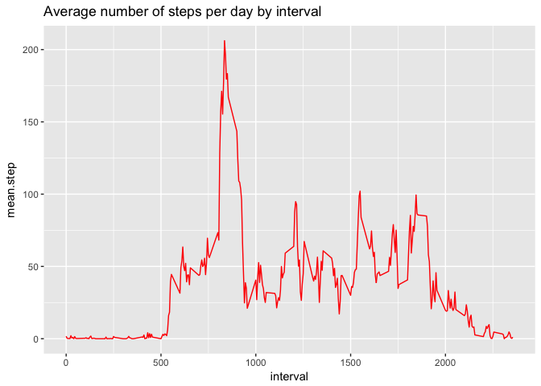
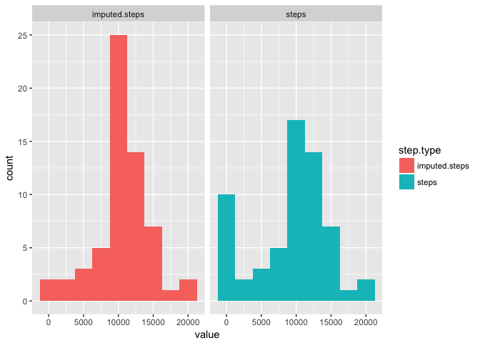
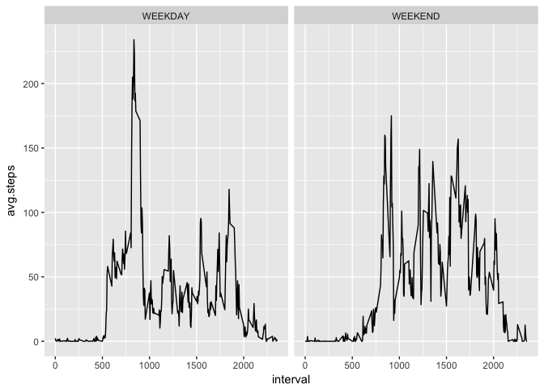

# Reproducible Research: Peer Assessment 1


## 1 Loading and preprocessing the data

Let's load the tidyverse package which we'll use for the rest of the analysis
and what is in the first few rows of the the activity.zip provided:


```r
library(tidyverse)
```

```
## Loading tidyverse: ggplot2
## Loading tidyverse: tibble
## Loading tidyverse: tidyr
## Loading tidyverse: readr
## Loading tidyverse: purrr
## Loading tidyverse: dplyr
```

```
## Conflicts with tidy packages ----------------------------------------------
```

```
## filter(): dplyr, stats
## lag():    dplyr, stats
```

```r
zip_file <- unzip("activity.zip")
activity.data <- read.table(zip_file,stringsAsFactors = FALSE, 
                            sep = ",", header = TRUE)
head(activity.data)
```

```
##   steps       date interval
## 1    NA 2012-10-01        0
## 2    NA 2012-10-01        5
## 3    NA 2012-10-01       10
## 4    NA 2012-10-01       15
## 5    NA 2012-10-01       20
## 6    NA 2012-10-01       25
```

Let's examine the structure of activity.data:


```r
str(activity.data)
```

```
## 'data.frame':	17568 obs. of  3 variables:
##  $ steps   : int  NA NA NA NA NA NA NA NA NA NA ...
##  $ date    : chr  "2012-10-01" "2012-10-01" "2012-10-01" "2012-10-01" ...
##  $ interval: int  0 5 10 15 20 25 30 35 40 45 ...
```

The date column is obviously a date but stored as a character vector. Let's fix
that by loading the lubridate package:


```r
library(lubridate)
```

```
## 
## Attaching package: 'lubridate'
```

```
## The following object is masked from 'package:base':
## 
##     date
```

```r
activity.data$date <- as_date(activity.data$date)
str(activity.data)
```

```
## 'data.frame':	17568 obs. of  3 variables:
##  $ steps   : int  NA NA NA NA NA NA NA NA NA NA ...
##  $ date    : Date, format: "2012-10-01" "2012-10-01" ...
##  $ interval: int  0 5 10 15 20 25 30 35 40 45 ...
```

Great our data is now nice and tidy.

## 2 What is mean total number of steps taken per day?

1. The total number of steps per day looks like:

```r
total_steps <- activity.data %>% 
    group_by(date) %>% 
    summarise(total.steps = sum(steps,na.rm=TRUE))
total_steps
```

```
## # A tibble: 61 x 2
##          date total.steps
##        <date>       <int>
##  1 2012-10-01           0
##  2 2012-10-02         126
##  3 2012-10-03       11352
##  4 2012-10-04       12116
##  5 2012-10-05       13294
##  6 2012-10-06       15420
##  7 2012-10-07       11015
##  8 2012-10-08           0
##  9 2012-10-09       12811
## 10 2012-10-10        9900
## # ... with 51 more rows
```

2. Histogram of total number of steps per day

```r
total_steps %>% ggplot(aes(total.steps)) + 
    geom_histogram(binwidth = 2500,fill="dark blue", col = "white")
```

<!-- -->

3. The mean and median total number of steps per day:

```r
mean(total_steps$total.steps)
```

```
## [1] 9354.23
```

```r
median(total_steps$total.steps)
```

```
## [1] 10395
```

## 3 What is the average daily activity pattern?

1. Calculate average number of steps per interval across all days:


```r
interval_steps <- activity.data %>% group_by(interval) %>% 
    summarise(mean.step = mean(steps,na.rm=TRUE))
interval_steps
```

```
## # A tibble: 288 x 2
##    interval mean.step
##       <int>     <dbl>
##  1        0 1.7169811
##  2        5 0.3396226
##  3       10 0.1320755
##  4       15 0.1509434
##  5       20 0.0754717
##  6       25 2.0943396
##  7       30 0.5283019
##  8       35 0.8679245
##  9       40 0.0000000
## 10       45 1.4716981
## # ... with 278 more rows
```

2. create line plot of interval vs. average number of steps:

```r
interval_steps %>% ggplot(aes(x = interval, y = mean.step)) +
    geom_line(col = "red") + labs(title = "Average number of steps per day by interval")
```

<!-- -->

3. Which 5-minute interval, on average across all the days in the dataset, 
contains the maximum number of steps?


```r
interval_steps %>% filter(mean.step == max(mean.step)) %>% select(interval)
```

```
## # A tibble: 1 x 1
##   interval
##      <int>
## 1      835
```
On average across the days in the dataset the interval that contains the average
number of steps is 835.

## 4 Imputing missing values

1. Total number of missing values


```r
sum(!complete.cases(activity.data))
```

```
## [1] 2304
```
There are 2304 rows that contain NAs.

2. Impute missing values with the average for the interval


```r
activity.data <- activity.data %>% group_by(interval) %>% 
    mutate(imputed.steps = replace(steps, is.na(steps), mean(steps,na.rm=TRUE)))
```

3. Create a dataset with the total number of steps per day


```r
total_steps <- activity.data %>% group_by(date) %>% 
    summarise(steps=sum(steps,na.rm=TRUE), imputed.steps=sum(imputed.steps)) 
total_steps1 <- total_steps %>%  gather("step.type","value",2:3)
```

4. Plot histogram to compare

```r
total_steps1 %>% ggplot(aes(value)) + 
    geom_histogram(binwidth = 2500,aes(fill = step.type))+facet_grid(.~step.type)
```

<!-- -->
4a. Calculate the mean and median of the original total steps per day vs. the imputed values

```r
total_steps1 %>% group_by(step.type) %>% summarise(mean=mean(value), median=median(value))
```

```
## # A tibble: 2 x 3
##       step.type     mean   median
##           <chr>    <dbl>    <dbl>
## 1 imputed.steps 10766.19 10766.19
## 2         steps  9354.23 10395.00
```
We can see that the mean and median of the total daily steps is higher once we impute the values

## 5 Are there differences in activity patterns between weekdays and weekends?

Let's apply the weekday weekend tag to our dataset, summarise the average number of steps per interval
and plot the two as a line chart to compare:

```r
activity.data %>% mutate(day.type = ifelse(
    wday(date, label = TRUE) == "Sat" | wday(date, label = TRUE) == "Sun",
    "WEEKEND","WEEKDAY")) %>% 
    group_by(day.type,interval) %>% 
    summarise(avg.steps = mean(steps, na.rm = TRUE)) %>% 
    ggplot(aes(x=interval,y=avg.steps))+geom_line()+facet_grid(.~day.type)
```

<!-- -->
